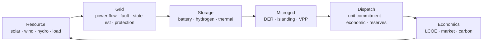

# tpt-energy

> Power systems, resource modeling, storage, dispatch, and grid economics — pure Rust.

**Org:** TPT Solutions · **License:** MIT OR Apache-2.0 · **Repo:** `tpt-energy`

TPT Energy is a comprehensive, open-source toolkit for power-systems engineering
and energy-systems modeling, written in Rust and built on the TPT substrate
crates (`tpt-math`, `tpt-engineering`, `tpt-science`). It is designed for
research, planning, dispatch, real-time grid control, and in-browser
exploration via WebAssembly.

## Energy Cycle

TPT Energy follows the **Energy Cycle**: resources → grid → storage → microgrid
→ dispatch → economics, all of which integrate back into the TPT substrate
(materials degradation → device physics → grid dispatch).



## Crate Status

| Crate                             | Description                                  | Status   |
|-----------------------------------|----------------------------------------------|----------|
| `tpt-nrg-core`                    | Energy system data model                     | Stable   |
| `tpt-nrg-topology`                | Graph & Y-bus construction                   | Stable   |
| `tpt-nrg-timeseries`              | Load/generation/price profiles               | Stable   |
| `tpt-nrg-wasm`                    | Browser/edge WASM bindings                   | Alpha    |
| `tpt-nrg-solar`                   | Solar position & PV output                   | Alpha    |
| `tpt-nrg-wind`                    | Wind power & wake losses                     | Alpha    |
| `tpt-nrg-hydro`                   | Hydro power calculation                      | Alpha    |
| `tpt-nrg-load`                    | Load forecasting & demand response           | Alpha    |
| `tpt-nrg-powerflow`               | AC/DC power flow solvers                     | Alpha    |
| `tpt-nrg-fault`                   | Short-circuit (fault) analysis               | Alpha    |
| `tpt-nrg-state-estimation`        | Kalman-filter grid state estimator           | Planned  |
| `tpt-nrg-protection`              | Relay coordination & protection zones        | Planned  |
| `tpt-nrg-battery`                 | Battery storage & degradation                | Alpha    |
| `tpt-nrg-hydrogen`                | Electrolyzer / fuel-cell / H2 storage        | Alpha    |
| `tpt-nrg-thermal-storage`         | Thermal storage                              | Planned  |
| `tpt-nrg-der`                     | Distributed energy resources                 | Alpha    |
| `tpt-nrg-islanding`               | Loss-of-mains detection & resync             | Alpha    |
| `tpt-nrg-vpp`                     | Virtual power plant aggregation              | Planned  |
| `tpt-nrg-unit-commitment`         | MILP unit commitment                         | Alpha    |
| `tpt-nrg-economic-dispatch`       | Economic dispatch & storage arbitrage        | Alpha    |
| `tpt-nrg-reserve`                 | Spinning & contingency reserve               | Alpha    |
| `tpt-nrg-lcoe`                    | LCOE / NPV / IRR                             | Stable   |
| `tpt-nrg-market`                  | Market signal modeling                       | Alpha    |
| `tpt-nrg-carbon`                  | Carbon intensity                             | Stable   |

## Quick Start

```toml
# Cargo.toml
[dependencies]
tpt-nrg-core = "0.1"
tpt-nrg-powerflow = "0.1"
```

```rust
use tpt_nrg_core::EnergySystem;
use tpt_nrg_powerflow::{PowerFlowSolver, PowerFlowMethod};

let system = EnergySystem::from_json(include_str!("ieee14.json"))?;
let solver = PowerFlowSolver::new(PowerFlowMethod::NewtonRaphson);
let result = solver.solve(&system)?;
println!("{:?}", result);
```

## Examples

- `examples/ieee-14-bus-powerflow` — solve the IEEE 14-bus case
- `examples/solar-farm-layout` — solar position + PV output profile
- `examples/wind-farm-wake` — Jensen wake model
- `examples/microgrid-islanding` — islanding event + battery dispatch
- `examples/battery-arbitrage` — storage arbitrage from price forecast

## License

Licensed under either of [Apache-2.0](LICENSE-APACHE) or [MIT](LICENSE-MIT) at
your option.

Unless you explicitly state otherwise, any contribution intentionally submitted
for inclusion in the work by you, as defined in the Apache-2.0 license, shall be
dual licensed as above, without any additional terms or conditions.
