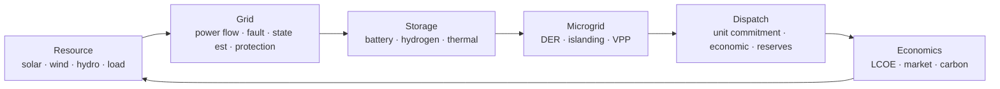

# tpt-energy

> Power systems, resource modeling, storage, dispatch, and grid economics — pure Rust.

**Org:** TPT Solutions · **License:** MIT OR Apache-2.0 · **Repo:** `tpt-energy`

[](https://github.com/tpt-solutions/tpt-energy/actions/workflows/ci.yml)
[](https://crates.io/crates/tpt-nrg-core)
[](https://docs.rs/tpt-nrg-core)
[](https://codecov.io/gh/tpt-solutions/tpt-energy)
[](LICENSE-MIT)
[](https://pypi.org/project/tpt-nrg/)
[](https://www.npmjs.com/package/tpt-nrg)

TPT Energy is a comprehensive, open-source toolkit for power-systems engineering
and energy-systems modeling, written in Rust and built on the TPT substrate
crates (`tpt-math`, `tpt-engineering`, `tpt-science`). It is designed for
research, planning, dispatch, real-time grid control, and in-browser
exploration via WebAssembly.

## Install

Rust, from crates.io:

```toml
[dependencies]
tpt-nrg-core = "0.1"
tpt-nrg-powerflow = "0.1"
```

Prebuilt binaries and bindings:

```sh
cargo install tpt-nrg-cli      # command-line interface
pip install tpt-nrg           # Python bindings
npm install tpt-nrg           # WebAssembly bindings
```


## Energy Cycle

TPT Energy follows the **Energy Cycle**: resources → grid → storage → microgrid
→ dispatch → economics, all of which integrate back into the TPT substrate
(materials degradation → device physics → grid dispatch).


```mermaid
flowchart LR
    A[Resource<br>solar · wind · hydro · load] --> B[Grid<br>power flow · fault · state est · protection]
    B --> C[Storage<br>battery · hydrogen · thermal]
    C --> D[Microgrid<br>DER · islanding · VPP]
    D --> E[Dispatch<br>unit commitment · economic · reserves]
    E --> F[Economics<br>LCOE · market · carbon]
    F --> A
```

## Crate Status

| Crate                             | Description                                  | Status   |
|-----------------------------------|----------------------------------------------|----------|
| `tpt-nrg-core`                    | Energy system data model                     | Stable   |
| `tpt-nrg-topology`                | Graph & Y-bus construction                   | Stable   |
| `tpt-nrg-timeseries`              | Load/generation/price profiles               | Stable   |
| `tpt-nrg-wasm`                    | Browser/edge WASM bindings                   | Alpha    |
| `tpt-nrg-solar`                   | Solar position & PV output                   | Stable   |
| `tpt-nrg-wind`                    | Wind power & wake losses                     | Stable   |
| `tpt-nrg-hydro`                   | Hydro power calculation                      | Stable   |
| `tpt-nrg-load`                    | Load forecasting & demand response           | Stable   |
| `tpt-nrg-powerflow`               | AC/DC power flow solvers (NR with Q limits)  | Stable   |
| `tpt-nrg-fault`                   | Short-circuit (fault) analysis               | Stable   |
| `tpt-nrg-state-estimation`        | DC-approx WLS grid state estimator           | Alpha    |
| `tpt-nrg-protection`              | Relay coordination & protection zones        | Stable   |
| `tpt-nrg-battery`                 | Battery storage & degradation                | Stable   |
| `tpt-nrg-hydrogen`                | Electrolyzer / fuel-cell / H2 storage        | Stable   |
| `tpt-nrg-thermal-storage`         | Thermal storage                              | Stable   |
| `tpt-nrg-der`                     | Distributed energy resources                 | Stable   |
| `tpt-nrg-islanding`               | Loss-of-mains detection & resync             | Stable   |
| `tpt-nrg-vpp`                     | Virtual power plant aggregation              | Stable   |
| `tpt-nrg-unit-commitment`         | Priority-list UC (MILP behind `substrate`)   | Alpha    |
| `tpt-nrg-economic-dispatch`       | Economic dispatch & storage arbitrage        | Stable   |
| `tpt-nrg-reserve`                 | Spinning & contingency reserve               | Stable   |
| `tpt-nrg-lcoe`                    | LCOE / NPV / IRR                             | Stable   |
| `tpt-nrg-market`                  | Market signal modeling                       | Stable   |
| `tpt-nrg-carbon`                  | Carbon intensity                             | Stable   |
| `tpt-nrg-interop`                 | MATPOWER / PSS-E / CIM / YAML / CSV I/O      | Alpha    |
| `tpt-nrg-viz`                     | SVG single-line diagram + heatmap            | Alpha    |
| `tpt-nrg-cli` (`tpt-nrg` binary)  | Command-line interface                       | Alpha    |
| `tpt-nrg-python` (`tpt_nrg` module) | Python bindings, built with maturin        | Alpha    |

See [`docs/book/src/crate-status.md`](docs/book/src/crate-status.md) for
detailed maturity notes per crate.

## Per-crate documentation

Every crate ships its own documentation, in its own directory:

- `crates/**/<crate>/README.md` — what the crate does, installation,
  a usage example, crates.io categories/keywords, status, and test
  instructions.
- `crates/**/<crate>/CHANGELOG.md` — per-crate changes in
  [Keep a Changelog](https://keepachangelog.com/en/1.1.0/) format.
- The [mdBook](docs/book/src/SUMMARY.md) walks through the architecture
  and each crate with tutorials.

## Quick Start

```toml
# Cargo.toml
[dependencies]
tpt-nrg-core = "0.1"
tpt-nrg-powerflow = "0.1"
```

```rust
use tpt_nrg_core::EnergySystem;
use tpt_nrg_powerflow::{PowerFlowSolver, PowerFlowMethod};

let system = EnergySystem::from_json(include_str!("ieee14.json"))?;
let solver = PowerFlowSolver::new(PowerFlowMethod::NewtonRaphson);
let result = solver.solve(&system)?;
println!("{:?}", result);
# Ok::<(), Box<dyn std::error::Error>>(())
```

## Command line

```sh
tpt-nrg run --system test-data/ieee/ieee14.json --method newton-raphson
tpt-nrg run --system case.json --fault-bus 4
tpt-nrg run --system case.json --dispatch 100
tpt-nrg convert --from matpower --to json case14.m -o case14.json
tpt-nrg viz --system case.json -o diagram.svg
```

## Python

```python
import tpt_nrg

system = tpt_nrg.System.from_file("test-data/ieee/ieee14.json")
result = system.power_flow()
print(result.converged, result.losses_mw)

try:
    system.power_flow(max_iterations=1)
except tpt_nrg.EnergyError as exc:
    if tpt_nrg.error_kind(exc) == "non_convergence":
        ...  # loosen the tolerance or fix the case
```

## Interoperability

`MATPOWER`, `PSS/E`, `CIM` (IEC 61970), `YAML`, `CSV`, and the native `JSON`
are all two-way via `tpt-nrg-interop`, and reachable from the CLI, the Python
bindings, and the browser bindings:

```rust
use tpt_nrg_interop::{from_text, to_text, Format};

let system = from_text(matpower_source, Format::Matpower)?;
let cim = to_text(&system, Format::Cim)?;
# Ok::<(), tpt_nrg_interop::InteropError>(())
```

## Visualization

`tpt-nrg-viz` renders a single-line diagram with a voltage and loading
heatmap as plain SVG — no asset pipeline, no JavaScript:

```rust
use tpt_nrg_viz::{render, VizOptions};

let svg = render(&system, Some(&result), &VizOptions::default());
# Ok::<(), Box<dyn std::error::Error>>(())
```

## Examples

- `examples/ieee-14-bus-powerflow` — solve the IEEE 14-bus case
- `examples/solar-farm-layout` — solar position + PV output profile
- `examples/wind-farm-wake` — wake models (Jensen / Frandsen / eddy-viscosity)
- `examples/microgrid-islanding` — islanding event + battery dispatch
- `examples/battery-arbitrage` — storage arbitrage from price forecast
- `examples/energy-cycle` — end-to-end: resource → storage → grid →
  dispatch → economics

The `examples/` directory is its own cargo workspace; build it with
`cargo check --manifest-path examples/Cargo.toml --all-targets`.

## License

Licensed under either of [Apache-2.0](LICENSE-APACHE) or [MIT](LICENSE-MIT) at
your option.

Unless you explicitly state otherwise, any contribution intentionally submitted
for inclusion in the work by you, as defined in the Apache-2.0 license, shall be
dual licensed as above, without any additional terms or conditions.
