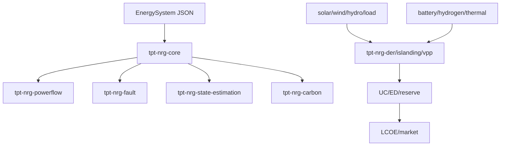

# Architecture

TPT Energy is organised around the **Energy Cycle**: a continuous loop in which resource availability drives grid behaviour, grid behaviour dictates storage needs, storage and microgrids feed back into dispatch, and economics re-frames the value of every upstream decision.

## Crate layout

The workspace groups crates by phase of the Energy Cycle:

| Group | Crates | Role |
|-------|--------|------|
| **Core** | `tpt-nrg-core`, `tpt-nrg-topology`, `tpt-nrg-timeseries`, `tpt-nrg-wasm` | Data model, graph algorithms, time-series containers, WASM bindings. |
| **Resource** | `tpt-nrg-solar`, `tpt-nrg-wind`, `tpt-nrg-hydro`, `tpt-nrg-load` | Solar position + PV output, wind power + wake, hydro head/flow, load forecast + DR. |
| **Grid** | `tpt-nrg-powerflow`, `tpt-nrg-fault`, `tpt-nrg-state-estimation`, `tpt-nrg-protection` | AC/DC power flow, short-circuit, WLS state estimation, relay coordination. |
| **Storage** | `tpt-nrg-battery`, `tpt-nrg-hydrogen`, `tpt-nrg-thermal-storage` | Battery SoC + degradation, H₂ round-trip, thermal SoC. |
| **Microgrid** | `tpt-nrg-der`, `tpt-nrg-islanding`, `tpt-nrg-vpp` | DER aggregation, islanding detection, VPP dispatch. |
| **Dispatch** | `tpt-nrg-unit-commitment`, `tpt-nrg-economic-dispatch`, `tpt-nrg-reserve` | UC, ED + arbitrage, spinning/contingency reserve. |
| **Economics** | `tpt-nrg-lcoe`, `tpt-nrg-market`, `tpt-nrg-carbon` | LCOE / NPV / IRR, market signals, carbon intensity. |

## Data flow

The crates share a single canonical data model — `EnergySystem` — defined in `tpt-nrg-core`. Downstream crates operate on `&EnergySystem` (read-only) and produce their own result structs.

## The `substrate` feature

Every crate that has a swappable upstream implementation in the broader TPT ecosystem exposes it behind a Cargo feature flag, `substrate`. When the flag is **off** (the default), the crate is fully self-contained with zero external numerical dependencies. When **on**, the crate re-exports substrate types and uses them where they provide a measurable advantage (sparse linear algebra for large power flows, MILP for unit commitment, etc.).

This makes TPT Energy useful in environments where the substrate crates are not available (CI, embedded, WASM) while still allowing production deployments to opt into upstream solvers when they're available.

## Where things live

- Source: `crates/`
- Examples: `examples/` (separate sub-workspace)
- Golden test data: `test-data/golden/`
- IEEE test cases: `test-data/ieee/`
- Benchmarks: `benches/`
- RFCs: `rfcs/`
- Documentation: `docs/book/` (this mdBook), `docs/api/` (generated `cargo doc`), `docs/rfc/` (proposed changes)
